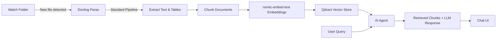

> **Tagline**: Ingest, parse, embed, and chat with your private documents — all running locally on your machine with zero data leaving your network.

---

## Purpose

**What problem does this solve?** Cloud document Q\&A tools (ChatGPT, Claude) require sending your private PDFs, contracts, and research papers to third-party servers. This pipeline keeps everything local: document parsing, vector storage, embeddings, and LLM inference all run on your hardware.

**Who is it for?** Privacy-conscious professionals, researchers, and teams who need to query private document collections without data leaving their network.

> [!info] Pipeline Overview
>
> - **Trigger:** Watch a folder for new documents (PDF, DOCX, images)
> - **Parse:** Docling extracts text, tables, and images with structure preservation
> - **Embed:** Local embedding model (nomic-embed-text) converts chunks to vectors
> - **Store:** Qdrant vector database indexes chunks with rich metadata
> - **Query:** n8n AI Agent retrieves relevant chunks and answers questions
> - **Interface:** Embedded web chat via n8n Chat widget

**Key Results / Achievements / Techniques / Concepts**

- Fully local: no API keys, no cloud services, no data exfiltration
- Supports PDF, DOCX, PPTX, HTML, TXT, MD, images
- Handles complex layouts: tables, columns, scanned documents (OCR)
- Production-ready: Docker Compose, folder watching, retry logic

---

## Tools & Technologies

| Tool / Technology | Description                                           | Link / Port                |
| ----------------- | ----------------------------------------------------- | -------------------------- |
| n8n               | Low-code workflow automation + AI Agent nodes         | `localhost:5678`           |
| Ollama            | Local LLM runner (llama3.2, embedding models)         | `localhost:11434`          |
| Docling           | IBM's open-source document parser (PDF, DOCX, images) | `localhost:5001/ui`        |
| Qdrant            | Vector database for similarity search                 | `localhost:6333/dashboard` |
| PostgreSQL        | Metadata and workflow state storage                   | `localhost:5432`           |
| Nginx             | Static file server for extracted images/tables        | `localhost:8080`           |
| Obsidian          | Knowledge base & documentation                        | Local Vault                |

---

## Architecture & Workflow



## Implementation Steps

### Step 1: Infrastructure Setup

Clone and run the self-hosted AI starter kit:

```bash
git clone https://github.com/theaiautomators/self-hosted-ai-starter-kit.git
cd self-hosted-ai-starter-kit
cp .env.example .env  # update secrets and passwords
```

Choose your hardware profile:

```bash
# NVIDIA GPU
docker compose --profile gpu-nvidia up -d

# AMD GPU
docker compose --profile gpu-amd up -d

# CPU only
docker compose --profile cpu up -d
```

### Step 2: Download Local Models

```bash
# LLM for answering questions
ollama pull llama3.2

# Embedding model for vector conversion
ollama pull nomic-embed-text
```

### Step 3: Build the Ingestion Pipeline (n8n)

| Step | Action | Details |
|---|---|---|
| **1** | Trigger - Watch Folder | Auto-ingest on new files. Add file-type filter (PDF, DOCX, images). Enable polling. |
| **2** | Read Files | Load from shared Docker volume (`/data/shared`). Use Pending + Processed subfolders. |
| **3** | Docling Parse | Standard pipeline for text extraction. VLM pipeline for complex tables/handwriting. |
| **4** | Extract Images | Save tables/images to Nginx-served folder (`localhost:8080/filename.jpg`). |
| **5** | Embeddings | Chunk size 500-1000 tokens with overlap. Use nomic-embed-text via Ollama. |
| **6** | Qdrant Store | Index in `private_docs` collection. Include metadata (filename, page, image\_url). |
| **7** | AI Agent | Connect LLM + Vector Store. Add optional Docling re-parsing and memory nodes. |

### Step 4: Create Chat Interface

```bash
npm install @n8n/chat
```

Embed the chat widget in a simple HTML page connected to your n8n workflow webhook. Activate the workflow to start accepting queries.

### Step 5: File Organization

```
/data/shared/
├── pending/       ← Drop documents here
│   ├── contract.pdf
│   ├── research_paper.docx
│   └── invoice.png
├── processed/     ← Completed files moved here automatically
│   ├── contract.pdf
│   └── ...
└── images/        ← Extracted tables and figures served via Nginx
    ├── contract_page3_table1.png
    └── ...
```

## Expansion Options

| Feature | Implementation | Benefit |
|---|---|---|
| **File-type routing** | Switch Case node: plain text, CSV/Excel, PDF (multimodal/OCR) | Optimized parsing per format |
| **Change detection** | Hash-based Record Manager Router | Only re-process changed documents |
| **Web scraping** | Bright Data integration | Add web sources to your knowledge base |
| **Multi-user** | n8n user management + Qdrant collection isolation | Team access with data separation |

## Pipeline Performance Notes

- **Standard Docling pipeline:** Fast, good for clean PDFs and DOCX. Start here.
- **VLM pipeline (vision model):** Slower but handles complex tables, handwriting, scanned docs. Switch only when standard quality is insufficient.
- **Chunk size:** 500-1000 tokens with 10-20% overlap balances retrieval precision with context coherence.
- **Metadata every chunk:** Always include `{filename, page_number, chunk_index, image_urls}` for traceability.

## Failure Modes & Design Checks

| Risk | Why It Matters | Mitigation |
|---|---|---|
| Bad parsing | RAG cannot recover facts that never entered the index correctly | Keep source-page metadata and spot-check extracted Markdown/tables |
| Weak chunking | Tables, headings, and references can be separated from their meaning | Use structure-aware chunking and preserve page/section labels |
| Retrieval false positives | Similar-looking chunks can crowd out the actual answer | Add reranking later via the upgraded pipeline |
| Silent cloud calls | One misconfigured node can break the privacy promise | Audit all n8n credentials and model endpoints before publishing |
| Stale vectors | Updated documents may coexist with old chunks | Add hash-based change detection before serious use |

## Reflections & Lessons Learned

> [!tip] What Went Well
>
> - Docker Compose makes the entire stack reproducible — `docker compose up` and you're running
> - Docling's structure preservation (headings, page boundaries, tables) is a major upgrade over naive text extraction
> - n8n's visual workflow builder makes the pipeline accessible to non-engineers
> - Fully local means zero ongoing API costs

> [!warning] What Could Be Improved
>
> - No reranking stage — the current pipeline relies on raw vector similarity, which can miss nuanced matches
> - No knowledge graph — entity relationships aren't captured, limiting multi-hop reasoning
> - Document change detection requires a Record Manager node — not built-in
> - Standard Docling pipeline can struggle with dense academic PDFs and complex table layouts

**Future Roadmap - Potential Applications**

- Add reranking stage (FlashRank or bge-reranker-v2-m3) for improved retrieval quality
- Integrate knowledge graph (LightRAG or Neo4j) for entity-aware multi-hop queries
- Implement Cog-RAG iterative probing for hard questions
- Add document classification and routing by document type
- Build a Streamlit or custom dashboard for collection management
