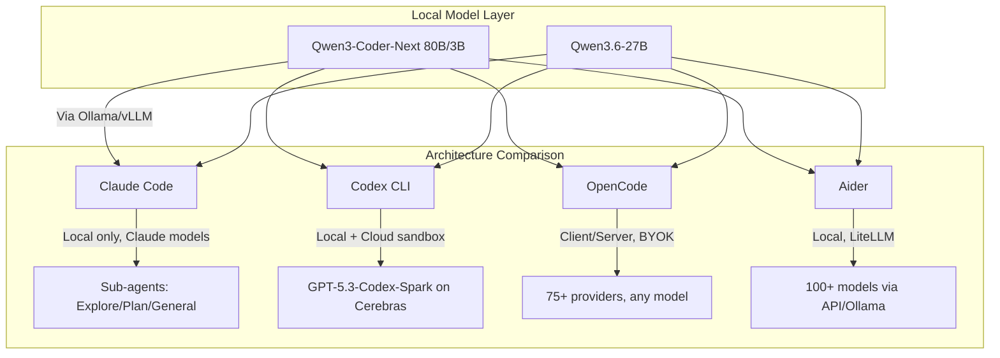

> **Tagline**: Six terminal coding agents, three architectures, one question — which one should you actually use in 2026?

---

## Purpose

**What problem does this solve?** The terminal AI coding agent space exploded in 2025-2026. Claude Code, Codex CLI, OpenCode, Aider, Pi, and Gemini CLI all claim to be the best — but they take fundamentally different approaches to model support, cost, architecture, and privacy. This guide cuts through the noise.

**Who is it for?** Developers who want to pick the right coding agent for their workflow, especially those interested in running local models or avoiding vendor lock-in.

> [!info] Key Findings
>
> - Claude Code leads on raw coding ability (Sonnet 4.6/Opus 4.7) but is Claude-only and \$100-200/mo
> - OpenCode (MIT, 156K stars) offers the most model flexibility — 75+ providers, BYOK, free tool
> - Codex CLI (Apache 2.0) now supports Ollama locally alongside GPT-5.3-Codex-Spark
> - Qwen3-Coder-Next (80B/3B MoE) hits 70.6% SWE-Bench and can run on 2x consumer GPUs
> - The 2026 trend: multi-agent architectures with sub-agents, parallel execution, and model routing

**Key Results / Achievements / Techniques / Concepts**

- SWE-Bench Verified scores across all harnesses and models
- Total cost of ownership: $0/mo vs $20/mo vs \$100-200/mo
- Local model viability: Qwen3.6-27B fits single GPU, Qwen3-Coder-Next fits 2x GPU

---

## Tools & Technologies

| Tool / Technology | Description                                                                  | Link / Port        |
| ----------------- | ---------------------------------------------------------------------------- | ------------------ |
| Claude Code       | Anthropic's terminal-first coding agent. Claude-only, sub-agent architecture | `claude` CLI       |
| OpenAI Codex CLI  | OpenAI's Rust-based coding agent. Apache 2.0, cloud+local, Ollama support    | `codex` CLI        |
| OpenCode          | MIT open-source, TypeScript+Bun+Go TUI. 75+ providers, client/server         | `opencode` CLI     |
| Aider             | OG open-source coding agent. Apache 2.0, 100+ models via LiteLLM             | `aider` CLI        |
| Pi                | MIT open-source, 324 models across 15+ providers                             | `pi` CLI           |
| Gemini CLI        | Google's Apache 2.0 agent, 1,000 free req/day                                | `gemini` CLI       |
| Qwen3-Coder-Next  | 80B/3B MoE, 70.6% SWE-Bench, Apache 2.0, 256K context                        | Ollama / vLLM      |
| Qwen3.6-27B       | Dense 27B, 68.9% SWE-Bench, fits single GPU at Q4                            | Ollama / llama.cpp |
| Obsidian          | Knowledge base & documentation                                               | Local Vault        |

---

## Architecture & Workflow



## Agent Capability Matrix

| Feature                    | Claude Code       | Codex CLI        | OpenCode        | Aider            | Pi              |
| -------------------------- | ----------------- | ---------------- | --------------- | ---------------- | --------------- |
| **License**                | Proprietary       | Apache 2.0       | MIT             | Apache 2.0       | MIT             |
| **Model flexibility**      | Claude-only       | OpenAI + Ollama  | 75+ providers   | 100+ via LiteLLM | 324 models      |
| **Local models**           | No                | Yes (Ollama)     | Yes (Ollama)    | Yes (Ollama)     | Yes (Ollama)    |
| **Sub-agents**             | Yes (3 types)     | No               | No              | No               | No              |
| **Cloud execution**        | No                | Yes (sandbox)    | No              | No               | No              |
| **SWE-Bench (best model)** | ~72.7% (Opus 4.7) | ~69.1% (GPT-5.3) | Varies by model | Varies by model  | Varies by model |
| **Cost**                   | $20-200/mo        | $20/mo + API     | Free (BYOK)     | Free (BYOK)      | Free (BYOK)     |
| **GitHub Stars**           | ~30K              | ~80K             | ~156K           | ~44K             | ~45K            |

## Cost Analysis

> [!warning] Cost Caveat
> Subscription tiers and agent metering are especially unstable in 2026. Claude Code docs describe wide per-developer cost variance, while Gemini CLI publishes request-based quotas that differ by auth method. Re-check official pages before presenting a fixed monthly winner.

| Agent       | Entry Cost  | High-Usage Cost   | Model Cost (per 1M tokens) |
| ----------- | ----------- | ----------------- | -------------------------- |
| Claude Code | $20/mo Pro  | $200/mo Max       | $3.00/$15.00 (Sonnet)      |
| Codex CLI   | $20/mo Plus | $200/mo Pro       | $2.50/$15.00 (Codex)       |
| OpenCode    | Free        | Free (BYOK)       | Provider-dependent         |
| Aider       | Free        | Free (BYOK)       | Provider-dependent         |
| Pi          | Free        | Free (BYOK)       | Provider-dependent         |
| Gemini CLI  | Free        | Free (1K req/day) | Free tier / pay after      |

## Local Model Recommendations

> [!warning] Local-Agent Caveat
> "Supports Ollama" does not always mean "works well as a coding agent." Tool-calling reliability, context handling, edit format, and model-specific prompts matter as much as raw benchmark scores.

| Model             | Params    | Active      | SWE-Bench | VRAM (Q4) | Hardware              |
| ----------------- | --------- | ----------- | --------- | --------- | --------------------- |
| Qwen3-Coder-Next  | 80B       | 3B (MoE)    | 70.6%     | ~52 GB    | 2x RTX 5090 / 1x H100 |
| Qwen3.6-27B       | 27B       | 27B (dense) | 68.9%     | ~17 GB    | 1x RTX 5090 / 4090    |
| DeepSeek V4-Flash | ~300B MoE | ~20B        | 78.4%     | ~150 GB   | 2x H100               |
| Gemma 2 27B       | 27B       | 27B         | ~55%      | ~17 GB    | 1x RTX 5090           |
| Phi-4             | 14B       | 14B         | ~52%      | ~9 GB     | 1x RTX 4090/7800 XT   |

## Implementation Steps

### Step 1: Define Your Constraints

- **Budget:** $0/mo → OpenCode/Aider/Pi; $20/mo → Codex/Claude Pro; \$200/mo → Claude Max
- **Privacy:** Local-only → OpenCode + Ollama; Cloud ok → Codex/Claude
- **Model preference:** Claude → Claude Code; OpenAI → Codex; Any → OpenCode/Aider/Pi

### Step 2: Install Your Agent

```bash
# Claude Code
npm install -g @anthropic-ai/claude-code

# Codex CLI
npm install -g @openai/codex

# OpenCode
npm install -g opencode

# Aider
pip install aider-chat

# Pi
npm install -g @earendil/pi
```

### Step 3: Configure Local Models

```bash
# Install Ollama
ollama pull qwen3.6-27b
ollama pull qwen3-coder-next

# Point your agent at local model
# OpenCode: opencode --model ollama/qwen3.6-27b
# Aider: aider --model ollama/qwen3.6-27b
# Codex: codex --model ollama --ollama-model qwen3.6-27b
```

## Decision Heuristics

| Constraint              | Best Starting Point                                           | Why                                                            |
| ----------------------- | ------------------------------------------------------------- | -------------------------------------------------------------- |
| Best raw coding quality | Claude Code or Codex with frontier cloud model                | Strong model + mature agent harness                            |
| Lowest vendor lock-in   | OpenCode or Aider                                             | Provider flexibility and BYOK/local options                    |
| Local-first privacy     | OpenCode/Aider/Codex via Ollama-compatible endpoint           | Keeps code and inference local when configured correctly       |
| Big refactors           | Agent with planning, approvals, and strong context management | Harness quality matters more than model leaderboard deltas     |
| Learning/debugging      | Aider or OpenCode                                             | Transparent CLI workflows make failure modes easier to inspect |

## Reflections & Lessons Learned

> [!tip] What the Data Shows
>
> - **No single best agent** — the right choice depends entirely on your model preference, budget, and privacy needs
> - **Local models are viable in 2026** — Qwen3.6-27B (68.9% SWE-Bench) and Qwen3-Coder-Next (70.6%) are good enough for ~75-80% of routine coding tasks
> - **Cost arbitrage is massive** — Qwen3 Coder Plus at $0.30/M input vs Claude Sonnet at $3.00/M is a 10x difference
> - **Multi-agent is the next frontier** — Claude Code's sub-agent architecture (Explore/Plan/General) is the most sophisticated, but OpenCode's snapshot undo system is a unique safety innovation

> [!warning] Caveats
>
> - SWE-Bench scores don't tell the whole story — real-world coding quality depends on context length, tool call accuracy, and subtle reasoning
> - Claude Code's Claude-only lock-in is a growing concern as GPT-5.5, Gemini 3 Pro, and DeepSeek all become competitive
> - Local model setup still requires technical comfort with ROCm/CUDA/Ollama configuration

**Future Roadmap - Potential Applications**

- Real hardware benchmarks on RX 7800 XT (16GB) — compare Qwen3.6-27B, Qwen3-Coder-Next, DeepSeek V4-Flash across agents
- Test Claude Code sub-agent workflow against OpenCode parallel agent teams
- Evaluate Codex CLI's cloud sandbox for CI/CD integration vs local-only approaches
- Monitor OpenCode's ACP protocol adoption as a standard for agent-client communication
- Track Qwen3-Coder-Next improvements — it's the most rapidly improving local coding model
