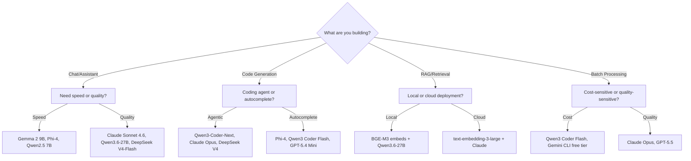

> **Tagline**: Stop guessing which model to use. A data-driven framework for picking the right LLM — by task, by budget, and by hardware.

---

## Purpose

**What problem does this solve?** The 2026 model landscape is overwhelming: 80+ providers, dense vs MoE architectures, quantization in 10+ formats, and pricing that ranges from $0.10/M tokens to $15/M tokens. This playbook gives you a repeatable decision framework.

**Who is it for?** Developers, team leads, and anyone who needs to pick models pragmatically — not chasing benchmarks but optimizing for real-world cost and quality.

> [!info] Key Findings
>
> - **Dense vs MoE is not about quality** — it's about deployment. Dense (Qwen3.6-27B) is simpler, MoE (Qwen3-Coder-Next 80B/3B) handles larger models with less compute per token
> - **Q4\_K\_M is the universal sweet spot** — minimal quality loss at 25% of FP16 size
> - **Cost varies 40x across providers** — Qwen3 Coder Plus at $0.30/M vs GPT-5.4 Codex at $2.50/M input
> - **Local models cover 80% of routine tasks** — reserve expensive cloud models for the hardest 20%

**Key Results / Achievements / Techniques / Concepts**

- Decision tree: task type → model architecture → quantization → deployment
- Cost-per-task comparison across 10+ model-provider combinations
- Quantization quality ladder with VRAM requirements
- When to use dense, when to use MoE, when to use cloud

## Tools & Technologies

| Tool / Technology            | Description                                    | Link / Port        |
| ---------------------------- | ---------------------------------------------- | ------------------ |
| Qwen3.6-27B                  | Dense 27B, best single-GPU quality, Apache 2.0 | Ollama / llama.cpp |
| Qwen3-Coder-Next             | 80B/3B MoE, 70.6% SWE-Bench                    | Ollama / vLLM      |
| DeepSeek V4-Flash            | ~300B MoE, best open general model             | API / Ollama       |
| Claude Sonnet 4.6 / Opus 4.7 | Best coding model, cloud-only                  | API                |
| GPT-5.5 / GPT-5.4 Codex      | OpenAI's coding-optimized models               | API                |
| Gemma 2 9B / 27B             | Google's efficient dense models                | Ollama / API       |
| Phi-4                        | Microsoft's 14B efficiency champion            | Ollama             |
| Obsidian                     | Knowledge base & documentation                 | Local Vault        |

---

## Architecture Decision Tree



## Dense vs MoE: The Real Trade-off

| Factor                   | Dense (e.g., Qwen3.6-27B)          | MoE (e.g., Qwen3-Coder-Next)  |
| ------------------------ | ---------------------------------- | ----------------------------- |
| **Total params**         | 27B                                | 80B                           |
| **Active per token**     | 27B                                | 3B                            |
| **VRAM at Q4**           | ~17 GB                             | ~52 GB                        |
| **Deployment**           | Single consumer GPU                | 2x GPU or 1x datacenter GPU   |
| **Inference speed**      | Fast (all params active)           | Fast (only 3B active)         |
| **Multi-step reasoning** | Excellent (dense inter-layer flow) | Good (routing approximate)    |
| **Broad knowledge**      | Good                               | Excellent (more total params) |
| **SWE-Bench Verified**   | 68.9%                              | 70.6%                         |
| **License**              | Apache 2.0                         | Apache 2.0                    |

**When to pick dense:** Single-GPU deployment, simpler infrastructure, predictable VRAM, you value deployment simplicity over peak benchmark scores.

**When to pick MoE:** You have multi-GPU or datacenter GPUs, you want both broad knowledge and fast inference, you need large context (256K vs 128K).

## Quantization Ladder

| Quant | Bits/Weight | Quality Retention | Size vs FP16 | VRAM for 27B | When to Use |
|---|---|---|---|---|---|
| Q2\_K | 2.5 | ~85% | 16% | ~5.5 GB | Fitting 70B on 16GB, degraded quality |
| Q3\_K\_M | 3.5 | ~92% | 22% | ~7 GB | Max context length, minimal available VRAM |
| Q4\_0 | 4.0 | ~93% | 25% | ~8.5 GB | Fast, lower quality than K-quants |
| **Q4\_K\_M** | **4.5** | **~97%** | **28%** | **~9.5 GB** | **Sweet spot — start here** |
| Q5\_K\_M | 5.5 | ~98% | 34% | ~11 GB | Quality-critical, VRAM available |
| Q6\_K | 6.0 | ~99% | 38% | ~13 GB | Near-lossless, ample VRAM |
| Q8\_0 | 8.0 | ~99.5% | 53% | ~18 GB | QC benchmarks, development |
| FP16 | 16 | 100% | 100% | ~54 GB | Training, reference only |

**Rule of thumb:** Q4\_K\_M retains ~97% of FP16 quality at 28% of the memory cost. Going higher (Q5\_K\_M) costs 20% more VRAM for ~1% quality gain. Going lower (Q3\_K\_M) saves VRAM but starts losing noticeable quality on reasoning tasks.

## Cost Comparison (Cloud APIs — 2026)

| Model             | Input/M | Output/M | SWE-Bench | Best For                    |
| ----------------- | ------- | -------- | --------- | --------------------------- |
| Qwen3 Coder Flash | $0.10   | $0.40    | ~58%      | High-volume, autocomplete   |
| Qwen3 Coder Plus  | $0.30   | $1.20    | ~72%      | Agentic coding, budget king |
| DeepSeek V4       | $0.30   | $0.50    | ~81%      | Best open general model     |
| GPT-5.4 Mini      | $0.15   | $0.60    | ~65%      | Balanced speed/quality      |
| GPT-5.4 Codex     | $2.50   | $15.00   | ~80%      | OpenAI ecosystem            |
| Claude Haiku 4    | $0.25   | $1.25    | ~60%      | Fast, cheap Claude          |
| Claude Sonnet 4.6 | $3.00   | $15.00   | ~78%      | Best coding quality         |
| Claude Opus 4.7   | $10.00  | $40.00   | ~83%      | Hardest problems            |
| GPT-5.5           | $5.00   | $20.00   | ~85%      | Frontier general model      |
| Gemini CLI (free) | $0      | $0       | —         | 1,000 free req/day          |

## Cost Efficiency Analysis

| Task Type | Recommended Model | Cost/Task (est.) | Quality |
|---|---|---|---|
| Quick code autocomplete | Qwen3 Coder Flash | $0.001 | Good |
| Bug fix / simple feature | Qwen3 Coder Plus | $0.005 | Excellent |
| Multi-file refactor | Claude Sonnet 4.6 | $0.05 | Best |
| Novel algorithm design | Claude Opus 4.7 | $0.15 | Frontier |
| Batch document processing | Qwen3 Coder Flash | $0.002/doc | Good |
| RAG query (simple) | Qwen3.6-27B local | $0 | Good |
| RAG query (complex) | DeepSeek V4 | $0.003 | Excellent |
| Code review | Claude Sonnet 4.6 | $0.03 | Best |

## Task-to-Model Mapping

### Chat & Conversation

| Need | Local Option | Cloud Option |
|---|---|---|
| Fast, simple Q\&A | Phi-4 or Gemma 2 9B | Gemini CLI (free) |
| Deep reasoning, analysis | Qwen3.6-27B | Claude Sonnet 4.6 |
| Creative writing | Qwen2.5 14B | GPT-5.5 |
| Multi-turn, long context | Qwen3-Coder-Next (256K) | Claude (200K) |

### Code Generation

| Need | Local Option | Cloud Option |
|---|---|---|
| Autocomplete | Phi-4, Qwen3 Coder Flash | GPT-5.4 Mini |
| Single-file generation | Qwen3.6-27B | Qwen3 Coder Plus |
| Multi-file agentic | Qwen3-Coder-Next | Claude Opus 4.7 |
| Test generation | Qwen3.6-27B | DeepSeek V4 |
| Code review | Qwen3-Coder-Next | Claude Sonnet 4.6 |

### Document Processing

| Need | Local Option | Cloud Option |
|---|---|---|
| Summarization | Qwen3.6-27B | Claude Haiku 4 |
| Data extraction | Qwen2.5 14B + tool calls | GPT-5.4 Mini |
| RAG embedding | BGE-M3 (local) | text-embedding-3-large |
| RAG generation | Qwen3.6-27B | Claude Sonnet 4.6 |

## Implementation: Your Tiered Strategy

```
Tier 1 (80% of tasks): Local Models — $0/task
  └─ Qwen3.6-27B (general), Qwen3-Coder-Next (coding)
  └─ Runs on your hardware, no API cost, full privacy

Tier 2 (15% of tasks): Budget Cloud — $0.001-0.005/task
  └─ Qwen3 Coder Plus or DeepSeek V4
  └─ For tasks where local models are borderline

Tier 3 (5% of tasks): Frontier Cloud — $0.03-0.15/task
  └─ Claude Sonnet/Opus or GPT-5.5
  └─ Only for the hardest problems where quality is critical
```

## Decision Heuristics

| Decision | Default | Escalate When |
|---|---|---|
| Local vs cloud | Local for private, routine, repeatable work | The task needs frontier reasoning, huge context, or reliability guarantees |
| Dense vs MoE | Dense for single-GPU simplicity | MoE when infrastructure can handle total model size and routing complexity |
| Q4 vs higher quant | Q4\_K\_M for first pass | Q5/Q6 when reasoning quality matters more than speed/context |
| Cheap vs frontier API | Cheap model for drafts and batch work | Frontier model for high-stakes code review, architecture, or final decisions |
| Manual vs auto routing | Manual tiers first | Automate only after logging cost, latency, and quality outcomes |

## Reflections & Lessons Learned

> [!tip] The Key Insight
>
> - **Model architecture matters less than deployment fit** — a 27B dense model on your GPU beats a 397B MoE that requires a datacenter
> - **The cost gradient is steeper than the quality gradient** — Qwen3 Coder Plus ($0.30/M) scores within 5-10 points of Claude Sonnet ($3.00/M) on most coding tasks
> - **Dense models are underrated in 2026** — Qwen3.6-27B beating Qwen3.5-Plus 397B on coding proves that training data quality and architecture matter more than parameter count
> - **Local-first, cloud-for-edge** — cover 80% of your tasks with local models, reserve expensive API calls for the 20% where it matters

> [!warning] Caveats
>
> - SWE-Bench and other benchmarks are proxies, not guarantees — real-world quality varies by domain and task
> - Model pricing changes frequently — the cost advantage of Qwen3 over Claude may narrow or widen
> - Latency matters — for interactive use, a fast local model can feel better than a smarter cloud model with network delay
> - New models arrive weekly — this playbook's specific recommendations will drift; the decision framework stays relevant

**Future Roadmap - Potential Applications**

- Build a cost-tracker dashboard that logs per-model cost, quality, and latency for your actual workloads
- Implement automatic model routing — small/cheap model for easy queries, escalate to expensive model for hard ones
- Test Qwen3-Coder-Next's 256K context against Claude's 200K for repository-scale understanding
- Evaluate new dense/MoE hybrids as they release — the line is blurring (e.g., 80B/3B MoE is practically dense-like for inference)
- Track the emerging "agentic model" category — models fine-tuned specifically for tool use and multi-step reasoning
