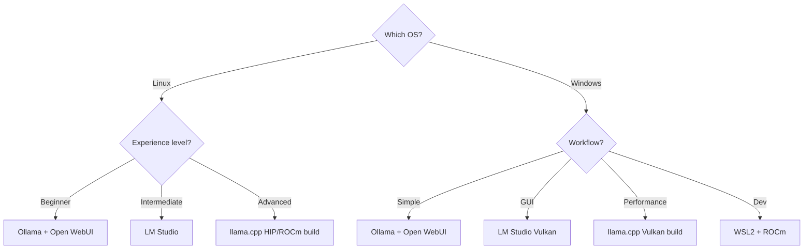

> **Tagline**: Everything you need to run local LLMs on AMD RDNA 3 — software stacks that work, models that fit 16GB VRAM, and real performance numbers.

---

## Purpose

**What problem does this solve?** Most local LLM guides assume NVIDIA CUDA. AMD users (RX 7800 XT, 16GB) get fragmented advice on Linux vs Windows, ROCm vs Vulkan, and which models actually fit. This guide consolidates everything for one specific, popular AMD card.

**Who is it for?** AMD GPU owners (especially RX 7800 XT / 16GB class) who want to run local LLMs without fighting the toolchain.

> [!info] Hardware Specs
> | Component | Spec |
> |---|---|
> | GPU | AMD Radeon RX 7800 XT, 16GB GDDR6 |
> | Memory Bandwidth | 624 GB/s |
> | Compute (FP16) | ~36.8 TFLOPS |
> | CPU | Ryzen 9 3900X (12C/24T, Zen 2) |
> | RAM | 32GB DDR4 |
> | Architecture | RDNA 3 (gfx1102) |

**Key Results / Achievements / Techniques / Concepts**

- Realistic performance: 48-96 t/s on 7-8B, 29 t/s on 13B, 15-35 t/s on 27-34B
- ROCm 6.x has solid gfx1102 support; Windows works via TheRock or WSL2
- Sweet spot: Qwen3.6-27B Q4\_K\_M (~17GB VRAM) — best quality-per-VRAM ratio

## Knowledgebase Links

- **Model choice:** [[llm-model-selection]] explains when to use local models, budget cloud APIs, or frontier models.
- **Coding workflow:** [[terminal-coding-agents-showdown]] applies the local-model hardware constraints to CLI coding agents.
- **Document AI:** [[private-rag-document-scanner-base]] is the practical local RAG workload this hardware can support.
- **Evergreen targets:** [[Local LLM Inference]], [[Quantization]], [[Model Routing]]

---

## Tools & Technologies

| Tool / Technology | Description                                     | Port / URL             |
| ----------------- | ----------------------------------------------- | ---------------------- |
| Ollama            | Easiest local LLM runner, solid ROCm support    | `localhost:11434`      |
| llama.cpp         | Fastest inference engine, Vulkan + HIP backends | CLI / `localhost:8080` |
| LM Studio         | GUI-based model discovery + benchmarking        | Desktop app            |
| vLLM              | Production-grade serving with PagedAttention    | `localhost:8000`       |
| ROCm 6.x          | AMD's GPU compute platform (Linux)              | —                      |
| TheRock           | Community ROCm build for Windows AMD GPUs       | —                      |
| Obsidian          | Knowledge base & documentation                  | Local Vault            |

---

## Software Stack Decision Tree



## Model Recommendations by VRAM

### Fits Entirely in 16GB VRAM (Q4\_K\_M)

| Model            | Size (Q4)  | Est. t/s   | Use Case                                |
| ---------------- | ---------- | ---------- | --------------------------------------- |
| Llama 3.1/3.2 8B | ~5.5 GB    | 60-96      | Fast chat, general purpose              |
| Mistral 7B v0.3  | ~4.5 GB    | 70-100     | Fast, strong for its size               |
| Qwen2.5 7B       | ~5 GB      | 60-90      | Strong reasoning, coding                |
| Phi-4 14B        | ~9 GB      | 30-40      | Microsoft's compact powerhouse          |
| Gemma 2 9B       | ~6 GB      | 50-70      | Google, excellent instruction following |
| Qwen2.5 14B      | ~9 GB      | 25-35      | Best balance of speed+quality on 16GB   |
| **Qwen3.6-27B**  | **~17 GB** | **~15-25** | **Best quality, needs partial offload** |

### Needs CPU Offloading (16GB VRAM + 64GB RAM)

| Model                     | Total Size | VRAM Use           | Est. t/s | Notes                               |
| ------------------------- | ---------- | ------------------ | -------- | ----------------------------------- |
| Qwen3-Coder-Next (80B/3B) | ~52 GB     | Full GPU           | 10-20    | MoE — only 3B active per token      |
| Gemma 2 27B               | ~17 GB     | Full GPU + offload | 15-30    | Near full GPU fit at Q4             |
| Qwen3.6-27B               | ~17 GB     | Full GPU           | 20-35    | Dense 27B, beats 397B MoE on coding |
| Mixtral 8x7B              | ~26 GB     | Partial GPU        | 15-25    | MoE — selective expert offload      |
| Llama 3.1 70B             | ~40 GB     | Partial GPU        | 5-15     | 64GB RAM makes hybrid viable        |

## Performance Estimates (Research-Based)

| Model | Q4\_K\_M | GPU Only | Hybrid (GPU+CPU) | Context |
|---|---|---|---|---|
| Llama 3B | ~2 GB | 130 t/s | — | Fastest small model |
| Llama 7B | ~4.5 GB | 48 t/s | — | Community benchmarked |
| Qwen2.5 14B | ~9 GB | 29 t/s | — | Fits entirely |
| Gemma 2 27B | ~17 GB | 20-35 t/s | — | Borderline full GPU |
| Qwen3.6-27B | ~17 GB | 15-25 t/s | — | Edge case, tune carefully |
| Qwen3-Coder-Next | ~52 GB | — | 10-20 t/s | MoE, CPU handles inactive experts |
| Llama 3.1 70B | ~40 GB | — | 5-15 t/s | 64GB RAM ideal for hybrid |

## Quantization Guide

| Format | Bits/Weight | Quality | Size vs FP16 | Recommendation |
|---|---|---|---|---|
| Q4\_K\_M | ~4.5 | Excellent | ~25% | **Sweet spot — start here** |
| Q5\_K\_M | ~5.5 | Near-perfect | ~33% | For quality-critical use |
| Q3\_K\_M | ~3.5 | Good | ~20% | When you need max context |
| Q2\_K | ~2.5 | Degraded | ~15% | Only for fitting large models |
| Q8\_0 | ~8.5 | Near-lossless | ~53% | Only with ample VRAM |
| FP16 | 16 | Lossless | 100% | Reference only, VRAM expensive |

## Setup Guides

### Option A: Ollama (Easiest, Recommended First)

```bash
# Install (Linux: ROCm auto-detected, Windows: DirectML)
ollama pull qwen3.6-27b
ollama pull phi-4
ollama pull llama3.2

# Test
ollama run qwen3.6-27b "Write a quick sort in Python"

# Serve for other apps
ollama serve
```

### Option B: llama.cpp (Best Performance)

```bash
# Clone and build with HIP/ROCm support
git clone https://github.com/ggerganov/llama.cpp
cd llama.cpp
cmake -B build -DGGML_HIP=ON -DAMDGPU_TARGETS=gfx1102
cmake --build build --config Release

# Run with full GPU offload
./build/bin/llama-cli -m Qwen3.6-27B-Q4_K_M.gguf -n 2048 -ngl 99

# Run with partial offload (e.g., 20 layers on GPU, rest on CPU)
./build/bin/llama-cli -m Llama-3.1-70B-Q4_K_M.gguf -n 2048 -ngl 20 -t 24
```

### Option C: LM Studio (GUI + Easy Benchmarking)

- Download from lmstudio.ai
- ROCm/Vulkan auto-detection on modern builds
- Built-in benchmark tool for t/s testing
- Model browser + one-click download

## Optimizations

| Technique | How | Benefit |
|---|---|---|
| Layer Offloading | `-ngl N` in llama.cpp | Balance GPU VRAM vs CPU speed |
| KV Cache Quantization | `--cache-type-k q8_0` | Reduce KV cache VRAM by ~50% |
| Context Length | `-c 4096` for 16GB, `-c 8192` with 64GB RAM | Longer conversations |
| Thread Count | `-t 24` (matches 3900X cores) | Max CPU throughput for offloaded layers |
| Batch Size | `--ubatch-size 512` | Better GPU utilization for prompt processing |
| Flash Attention | ROCm 6.x + llama.cpp HIP build | Faster attention, less memory |

## Decision Heuristics

| If you need... | Start with... | Why |
|---|---|---|
| Fast local chat | 7B-14B Q4\_K\_M in Ollama | Least setup friction and high tokens/sec |
| Better coding/reasoning | 14B-27B Q4\_K\_M in llama.cpp | More control over context, layers, and cache |
| Maximum privacy RAG | Local embeddings + 7B-14B generator | Keeps documents and prompts on-device |
| Large-model experiments | Hybrid CPU/GPU offload | 64GB RAM makes partial offload viable, but slower |
| Reproducible blog claims | llama-bench + VRAM screenshots | Turns estimates into publishable evidence |

## Common Pitfalls

| Problem | Symptom | Fix |
|---|---|---|
| ROCm not detecting GPU | `rocm-smi` shows no devices | Set `HSA_OVERRIDE_GFX_VERSION=11.0.0` |
| VRAM overflow | LLM crashes with CUDA OOM equivalent | Reduce context (`-c 2048`), use Q4\_K\_M |
| Windows ROCm issues | Poor performance or crashes | Use TheRock community builds or WSL2 |
| Thermal throttling | t/s drops after 5-10 min | Undervolt GPU, improve case airflow |
| Model not responding | Ollama hangs | Check VRAM usage — likely OOM with too much context |

## Reflections & Lessons Learned

> [!tip] Key Takeaways
>
> - **Qwen3.6-27B at Q4\_K\_M is the best model for this case** — it's a dense 27B that beats 397B MoE models on coding benchmarks and fits at the edge of 16GB VRAM
> - **Linux + ROCm is the most stable path** for AMD. Windows is workable via Vulkan (llama.cpp) or WSL2, but not optimal
> - **Start with Ollama, graduate to llama.cpp** — Ollama gives you instant results, llama.cpp gives you every tuning knob

> [!warning] Realistic Expectations
>
> - 30B+ models require partial CPU offload — Q4\_K\_M of a 27B model uses ~17GB, leaving almost no room for KV cache
> - ROCm stability varies by Linux distribution — Ubuntu 22.04/24.04 is the safest bet

**Future Roadmap - Potential Applications**

- Run real benchmarks on this hardware — publish actual t/s, VRAM usage, and model quality scores
- Test Qwen3-Coder-Next in hybrid mode (GPU for active experts, CPU for inactive)
- Compare vLLM vs llama.cpp vs Ollama serving performance on the same models
