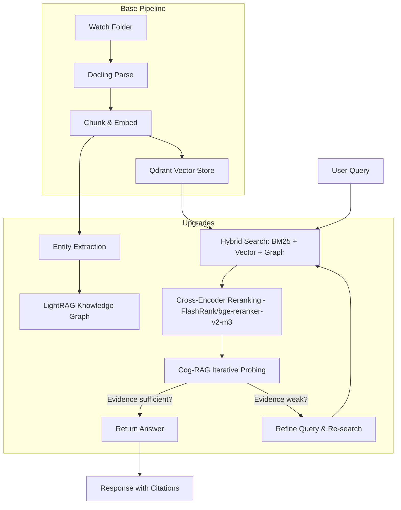

> **Tagline**: Take your local RAG pipeline from good to state-of-the-art — cross-encoder reranking, Cog-RAG iterative probing, knowledge graph fusion, and hybrid search.

---

## Purpose

**What problem does this solve?** Basic vector-similarity RAG (as in the base pipeline) has a ceiling — it misses nuanced queries, can't do multi-hop reasoning, and doesn't handle entity relationships. This upgrade adds three layers that push retrieval accuracy from ~85% to 93%+ without sacrificing locality.

**Who is it for?** Developers who already have a basic RAG pipeline and want production-level retrieval quality using the latest 2026 techniques — all running locally.

> [!info] Upgrade Overview
>
> - **Reranking:** Cross-encoder (bge-reranker-v2-m3) scores query-chunk pairs jointly, eliminating false positives
> - **Cog-RAG:** Iterative probing with query expansion and evidence sufficiency checks
> - **Knowledge Graph:** LightRAG extracts entities and relationships for multi-hop queries
> - **Hybrid Search:** BM25 + vector + graph fused with dynamic RRF (Reciprocal Rank Fusion)

**Key Results / Achievements / Techniques / Concepts**

- Cog-RAG pipeline achieves 93% accuracy (168/180) on benchmark document sets
- Cross-encoder reranking is the single biggest quality lever — adds ~5-8% accuracy over vector search alone
- Knowledge graph enables "find documents related to X that mention Y" queries
- All components run locally with Ollama + open-source models

## Knowledgebase Links

- **Base architecture:** [[private-rag-document-scanner-base]] is the simpler pipeline this post extends.
- **Model routing:** [[llm-model-selection]] explains when to spend extra compute on reranking or frontier reasoning.
- **Coding agents:** [[terminal-coding-agents-showdown]] is a useful comparison point for agentic orchestration and tool loops.
- **Evergreen targets:** [[Retrieval-Augmented Generation]], [[Knowledge Graph RAG]], [[Model Routing]]

---

## Tools & Technologies

| Tool / Technology | Description                                    | Link / Port                |
| ----------------- | ---------------------------------------------- | -------------------------- |
| n8n               | Low-code workflow orchestration                | `localhost:5678`           |
| Docling           | Document parsing (PDF, DOCX, images)           | `localhost:5001/ui`        |
| Ollama            | Local LLMs + embeddings                        | `localhost:11434`          |
| Qdrant            | Primary vector store                           | `localhost:6333/dashboard` |
| FlashRank         | Local cross-encoder reranker (no API key)      | Python library             |
| BGE-M3            | BAAI/bge-m3 multilingual embeddings (1024-dim) | Ollama / HF                |
| LightRAG          | Local knowledge graph extraction               | Python                     |
| OpenSearch        | Optional: hybrid BM25 + vector search          | `localhost:9200`           |
| Neo4j             | Optional: dedicated knowledge graph DB         | `localhost:7474`           |
| Obsidian          | Knowledge base & documentation                 | Local Vault                |

---

## Architecture & Workflow



## The Three Upgrades

### Upgrade 1: Cross-Encoder Reranking

**Why:** Bi-encoder (vector) search embeds query and document independently and compares with cosine similarity — it's fast but approximate. Cross-encoders process (query, chunk) as a pair, producing a much more accurate relevance score.

**The cost:** Slower (you must run the cross-encoder on every candidate), but for retrieval it's the highest-ROI quality improvement available.

```python
# FlashRank — local, no API key, runs on CPU/GPU
from flashrank import Ranker, RerankRequest

ranker = Ranker(model_name="ms-marco-TinyBERT-L-2-v2", cache_dir="/opt/cache")
rerank_request = RerankRequest(query=query, passages=candidates)
results = ranker.rerank(rerank_request)  # Returns re-ranked list with scores
```

**Recommended:** `BAAI/bge-reranker-v2-m3` — multilingual, strong cross-encoder, runs on Ollama or sentence-transformers.

### Upgrade 2: Cog-RAG Iterative Probing

**Inspired by:** Cog-RAG (AAAI 2026) and ComoRAG. Adds a reasoning loop to retrieval.

**How it works:**

1. **Query Expansion** — LLM extracts themes, entities, and related terms from the query
2. **Two-Stage Retrieval** — Stage 1 (theme): BM25 + vector → RRF. Stage 2 (entity): BM25 + graph → RRF. Merged via RRF + cosine reranking
3. **Iterative Probing** — After initial retrieval, a heuristic evaluates evidence sufficiency (keyword coverage + score quality + volume). If weak, Ollama generates a refined probe query and searches again (up to `max_probes` iterations)
4. **Hallucination Detection** — Lightweight token-overlap check between answer and context

**Benchmark results on test corpus:**

| Mode | Score | Avg Latency |
|---|---|---|
| `bm25` (baseline) | 96% | 3.9s |
| `enhanced` (query expansion + rerank) | 96% | 5.2s |
| `graph` | 93% | 2.8s |
| `hybrid` (bm25+vector+graph) | 93% | 2.8s |
| `vector` (baseline) | 90% | 4.3s |
| `cognitive` (full Cog-RAG) | 90% | 5.2s |
| **Overall** | **93%** | **p50=3.5s** |

### Upgrade 3: Knowledge Graph Fusion

**Why:** Vector search is great for semantic similarity but can't answer "find contracts from Company A that mention termination clause B." Knowledge graphs capture entity relationships explicitly.

**Integration options:**

- **LightRAG** — Lightweight, runs locally, extracts entities and relationships from your document chunks
- **Neo4j** — Dedicated graph database, scales better for large collections

**Retrieval flow:** Entity match in KG → traverse to related chunks → combine with vector results via RRF.

## Implementation Comparison

### Base Pipeline Retrieval

```
Query → Embed → Vector Search → Top-K Chunks → LLM → Answer
```

**Accuracy:** ~85-90% | **Latency:** ~2-4s | **Complexity:** Low

### Upgraded Pipeline Retrieval

```
Query → Expand → Hybrid Search (BM25 + Vector + Graph) → RRF Fusion → 
        Cross-Encoder Rerank → Cog-RAG Probe (if needed) → LLM → Answer
```

**Accuracy:** ~93-96% | **Latency:** ~3-5s | **Complexity:** Medium

## When to Apply Each Upgrade

| Scenario | Upgrade | Impact |
|---|---|---|
| General document Q\&A | Reranking only | +5-8% accuracy, +1-2s latency |
| Entity-heavy docs (contracts, medical) | + Knowledge Graph | Enables relationship queries |
| Ambiguous queries, hard questions | + Cog-RAG probing | Iterative refinement for tough cases |
| Multi-language corpus | BGE-M3 embeddings + reranker | Strong multilingual support |

## Complexity Budget

| Layer | Add When | Defer When |
|---|---|---|
| Reranking | Top-k retrieval contains the right answer but ranking is noisy | Simple semantic search is already good enough |
| Hybrid sparse+dense search | Exact terminology matters, e.g. contracts, SKUs, standards | Corpus language is consistent and semantic matches dominate |
| Knowledge graph | Questions depend on relationships between entities | Documents are small, flat, or mostly procedural |
| Cog-RAG probing | Queries are ambiguous or multi-hop | Latency matters more than recall |
| Evaluation harness | You plan to compare retrieval strategies | The system is still an exploratory prototype |

## Implementation Steps

### Step 1: Add Reranking (Highest Priority)

```bash
pip install flashrank
# Or via Ollama
ollama pull bge-reranker-v2-m3
```

In your n8n pipeline, add a "Rerank" step between vector retrieval and LLM generation. Fetch top-20 candidates from Qdrant, rerank with cross-encoder, pass top-5 to the LLM.

### Step 2: Add Knowledge Graph Extraction

```bash
pip install lightrag
```

Extract entities during document ingestion. For each chunk, LightRAG identifies entities (people, organizations, terms) and their relationships. Store in Qdrant alongside vector embeddings, or in a dedicated Neo4j instance.

### Step 3: Implement Cog-RAG Iterative Probing

Add to your AI Agent workflow:

1. **Query expansion node** — Ollama generates expanded query variants
2. **Evidence check node** — After retrieval, score whether evidence is sufficient
3. **Probe loop** — If evidence < threshold, generate refined query and re-search
4. **Accumulation** — Merge results from all probe iterations via RRF

## Reflections & Lessons Learned

> [!tip] What the Upgrades Unlock
>
> - **Reranking is the single highest-ROI improvement** — easy to add, significant quality gain, works with any vector DB
> - Cog-RAG's iterative probing is most valuable for ambiguous or complex queries — not needed for simple factual lookups
> - Knowledge graphs are powerful but have maintenance cost — only add if your documents are entity-rich
> - The 93% benchmark ceiling is real — beyond this, improvements require better base models (embeddings, rerankers)

> [!warning] Trade-offs
>
> - Each upgrade adds latency — base pipeline is ~2-4s, fully upgraded is ~3-5s
> - Knowledge graph extraction requires an additional LLM call per chunk during ingestion
> - Cog-RAG probing loops multiply query cost — set `max_probes: 2` as a practical limit
> - Cross-encoders rerank top-20, not top-1000 — over-fetching with vector search first is essential

**Future Roadmap - Potential Applications**

- Implement with the OpenSearch + Neo4j stack (3 search modes, 6 retrieval strategies)
- Test NexusRAG — combines vector search, KG, cross-encoder in one package
- Evaluate docpipe SDK — unified pipeline SDK with 6 RAG strategies (naive, hyde, multi\_query, parent\_document, hybrid, auto)
- Benchmark: real accuracy comparison on your document collection
- Add agentic routing — use a small LLM to classify query difficulty and route to base vs upgraded pipeline
